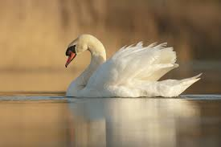
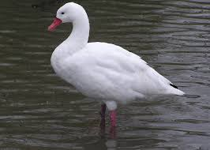
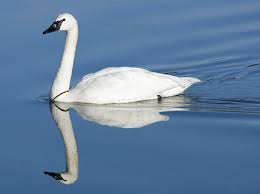

# task1
<!DOCTYPE html>
<html lang="en">

<head>
    <meta charset="UTF-8">
    <meta name="viewport" content="width=device-width, initial-scale=1.0">
    <title>Document</title>
</head>

<body style="background-color: rgb(238, 197, 203);">
    <h1 style="background-color: #f4f0e7;">Swans</h1>
     
    <H2>Hello, I'm batol and this website is about the very pretty birds, swans!</H2>
    Swans are waterbirds with heavy bodies and long necks. They swim gracefully, seeming to glide across the water. They
    are also strong fliers. Along with ducks and geese, swans belong to a family of birds called waterfowl in North
    America and wildfowl in Europe. Swans are the largest and least common of the waterfowl. Swans are found on or near
    water. Most types migrate, or fly long distances to spend different seasons in different regions.
     
     
    <h3>Types of swans:</h3>
    <ol type="a">
        <li>Mute swans
             
            
        </li>
        <li>Coscoroba swans
             
            
        </li>
        <li>Trumpeter swans
             
            
        </li>
         
         
         
        <h3>And this table shows where each type lives:</h3>
        <table style="border: black;">
            <thead>
                <th>Num</th>
                <th>Type</th>
                <th>Continent</th>
            </thead>
            <tbody>
                <tr>
                    <td>1</td>
                    <td> mute </td>
                    <td>Europe & Asia</td>
                </tr>
                <tr>
                    <td>2</td>
                    <td> Coscoroba </td>
                    <td>South America</td>
                </tr>
                <tr>
                    <td>3</td>
                    <td> Trumpeter </td>
                    <td>North America</td>
                </tr>
            </tbody>
        </table>
         
         
         
    </ol>
    <label for="text">
        <h3>What's your favorite swan?</h3>
    </label>
    <input type="text" placeholder="choose your fav swan!">
     
     
     
    <h3>Here's a video of cutesy swans waking up at sunrise :)</h3>
     
    <video controls>
        <source src="video/swanVideo.mp4" width="30%" height="30%">
    </video>
     
     
     
    <h3>Here's another video of a little swan family swimmng around :)</h3>
     
    <iframe width="560" height="315" src="https://www.youtube.com/embed/_Hgt56rY008?si=4qY7X3iNZsADHjEP"
        title="YouTube video player" frameborder="0"
        allow="accelerometer; autoplay; clipboard-write; encrypted-media; gyroscope; picture-in-picture; web-share"
        referrerpolicy="strict-origin-when-cross-origin" allowfullscreen></iframe>\
     
     
     
    <h3>For more information visit this page:</h3>
     
    <iframe src="https://en.wikipedia.org/wiki/Swan" frameborder="0" width="500px" height="500px"></iframe>

</body>

</html>